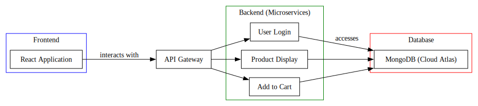

# Intersport E-commerce Platform

Welcome to the Intersport E-commerce Platform, an example microservices-based system for an online store.

## Architecture Overview

The system is designed with a microservices architecture, with each core feature implemented as an independent Google Cloud Function:

- User Login
- Product Display
- Add to Cart

These microservices interact with a single MongoDB database hosted on GCP Cloud Atlas and are routed through an API Gateway which directs incoming requests to the corresponding service.


## Frontend

The frontend is built with React and is located in the `frontend/intersport-frontend` directory.

### Setup

Navigate to the frontend directory and follow the README there to set up and run the frontend service:

```sh
cd frontend/intersport-frontend
```

## Backend

The backend services are found in the `backend` directory.

### Setup

Refer to the backend README for instructions on how to set up and run the backend services.

## Prerequisites

The project requires Node.js. It is recommended to use Node Version Manager (nvm) to manage your Node.js versions.

1. Install nvm by following the instructions at: https://github.com/nvm-sh/nvm
2. Use nvm to install and use the Node.js version specified in `.nvmrc`:

```sh
nvm use
```

## Database Schema

The MongoDB database consists of the following schemas:

### Carts

Represents shopping carts with references to products and their selected options.

- `_id`: Unique identifier for the cart
- `userId`: Reference to the user who owns the cart
- `items`: An array of items, where each item contains:
  - `productId`: Reference to the product
  - `color`: Selected color of the product
  - `size`: Selected size of the product
  - `quantity`: Number of products
  - `_id`: Unique identifier for the item

### Products

Represents products available in the store.

- `_id`: Unique identifier for the product
- `title`: Name of the product
- `description`: Description of the product
- `basePrice`: Base price of the product
- `options`: An array of available options for the product, including:
  - `color`: Available color
  - `image_url`: URL to the image representing the product in this color
  - `sizes`: An array of available sizes and their stock

### Users

Represents registered users.

- `_id`: Unique identifier for the user
- `username`: User's chosen username
- `password`: Hashed password for the user
- `fullName`: Full name of the user

## Running Locally

To run the services locally, make sure to set up both the frontend and backend as described in their respective README files.

## Contributing

Please read the contributing guidelines in the CONTRIBUTING.md file.

## License

This project is licensed under the MIT License - see the LICENSE file for details.
